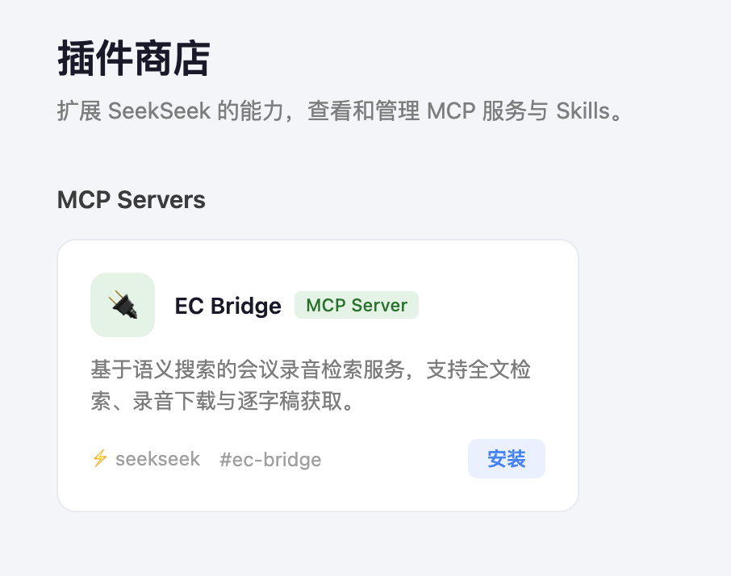

# seekseek-platform

AI platform monorepo — MCP servers, skills, and shared tooling.

## Packages

| Package | Description |
|---------|-------------|
| [packages/mcp-servers/ec-bridge](./packages/mcp-servers/ec-bridge/) | MCP server for semantic search over meeting records |

## 插件商店

> **Windows 用户需要在 WSL 中运行。** macOS / Linux 可直接跳到"启动服务"。

### 安装 WSL（Windows 用户）

以管理员身份打开 PowerShell，执行：

```powershell
wsl --install
```

安装完成后重启电脑，重启后会自动弹出 Ubuntu 终端，按提示设置用户名和密码，之后从开始菜单打开 **Ubuntu** 即可进入 WSL。

### 启动服务

在 WSL（或 macOS / Linux）终端中执行：

```bash
git clone https://github.com/magicalvate/seekseek-platform.git
cd seekseek-platform
python3 web/server.py
```

然后打开浏览器访问 http://localhost:7842



### 安装 EC Bridge（启动 Claude Code 前必须完成）

> ⚠️ **重要：请在启动 Claude Code 之前，先在插件商店中安装 EC Bridge MCP Server，否则会议下载功能将无法使用。**

在浏览器中打开 http://localhost:7842，进入**插件商店**，找到 **EC Bridge** 卡片，点击"安装"，等待安装完成后再启动 Claude Code。

### 更新

在项目目录下执行：

```bash
git pull
```

刷新浏览器即可生效，无需重启服务。

## Structure

```
seekseek-platform/
└── packages/
    └── mcp-servers/
        └── ec-bridge/   # Meeting records MCP
```
